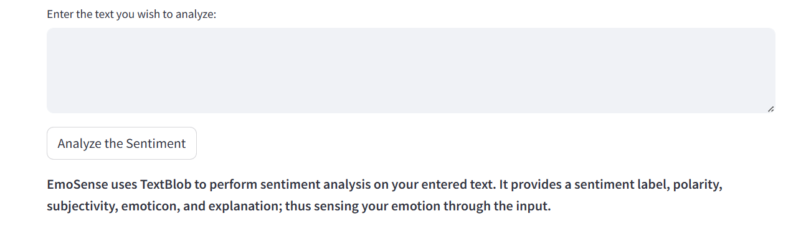
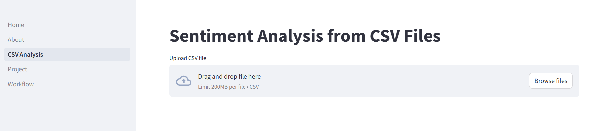
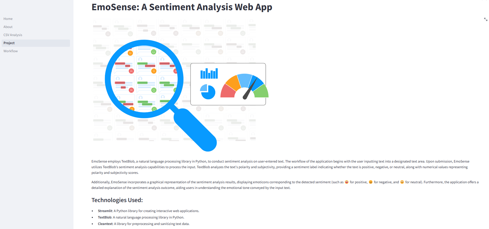
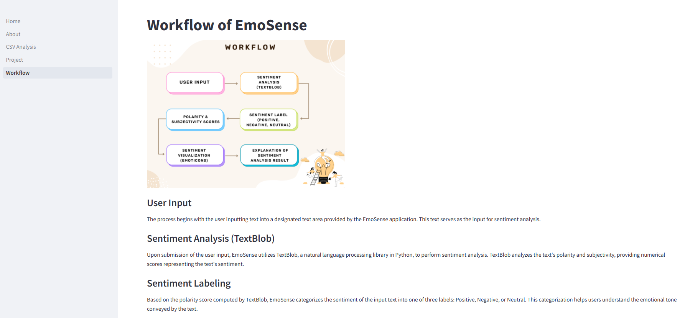

# EmoSense - A Sentiment Analysis Web App

This repository contains the code for a Sentiment Analysis web application developed using Streamlit and the TextBlob library.

## Description

EmoSense is a Python web app utilizing TextBlob for sentiment analysis of user-provided text. Users enter text as input, which is then analyzed for polarity (positive, negative, or neutral) and subjectivity. Results are presented with emoticons reflecting the sentiment, alongside numerical scores for polarity and subjectivity. The application also provides detailed explanations of the sentiment analysis outcome along with visualization to aid users in understanding the emotional tone conveyed by their input. In addition, this web app can also analyze sentiment in text data from CSV files. When a CSV file is uploaded, EmoSense automatically processes each entry using TextBlob for sentiment analysis. It calculates polarity and subjectivity scores for each entry and categorizes them as positive, negative, or neutral based on the polarity score.

## Features

- Input text area for users to enter text for sentiment analysis
- Real-time sentiment analysis
- Displays sentiment polarity (positive or negative) and subjectivity based on the input text
- Graphical representation and explanation of sentiment analysis results with emoticons
- User-friendly interface with Streamlit
- Analysis of sentiment by extracting data from CSV files.

## Technologies Used

- Python
- Streamlit
- TextBlob library
- Cleantext library

## App Screenshots

## Developer

Manoswita Bose
2347238
MCA-B, CHRIST (Deemed to be University)
